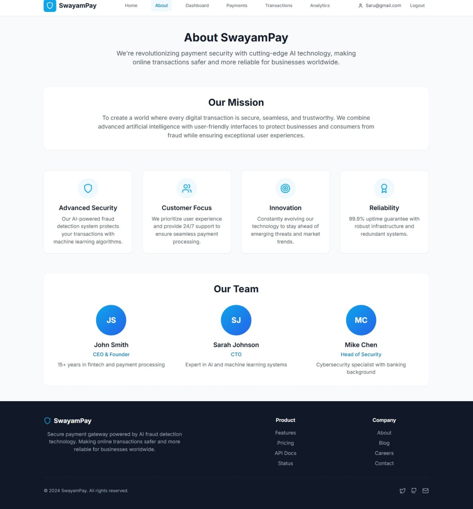
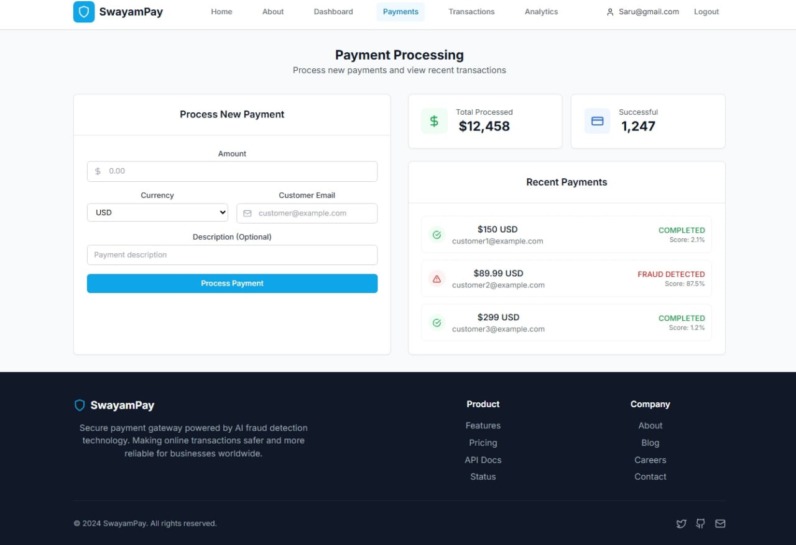
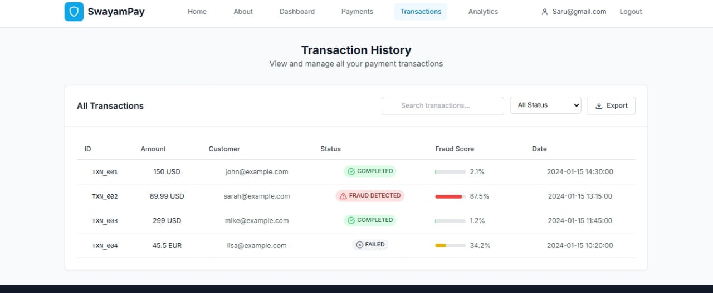

# 💳 SwayamPay – AI Powered Secure Payment Gateway

<div align="center">


### 🚀 Secure Payments Powered by AI

*An intelligent payment gateway system that detects fraudulent transactions before processing payments.*

</div>

---

# 📌 Introduction

## 🔹 What is SwayamPay?

**SwayamPay** is an **AI-based Payment Gateway System** developed using **Spring Boot** and **Spring Security**.

The main goal of this project is to provide **secure online transactions** by identifying suspicious payment activities using fraud detection logic.

Nowadays online payment frauds are increasing rapidly.
SwayamPay works like a **smart security guard** that analyzes user transaction behavior before approving payments.

Instead of only processing transactions, the system also **thinks intelligently** before allowing a payment.

---

# 🌟 Key Highlights

✅ AI-Based Fraud Detection
✅ Secure Authentication & Authorization
✅ Role-Based Access Control
✅ JWT Token Security
✅ REST API Architecture
✅ Transaction Monitoring
✅ Real-Time Fraud Alerts
✅ Payment History Tracking
✅ Secure Payment Workflow

---

# 🛠️ Tech Stack

| Technology         | Usage                          |
| ------------------ | ------------------------------ |
| ☕ Java             | Backend Development            |
| 🌱 Spring Boot     | Application Framework          |
| 🔐 Spring Security | Authentication & Authorization |
| 🗄️ MySQL          | Database                       |
| 🎫 JWT             | Secure Token Authentication    |
| 🔗 REST APIs       | Communication Layer            |
| 🤖 AI Logic        | Fraud Detection                |
| 📦 Maven           | Dependency Management          |
| 🧪 Postman         | API Testing                    |

---

# 🧠 How SwayamPay Works

## 📍 Payment Workflow

```text
User Login
    ↓
Authentication using Spring Security
    ↓
User Enters Payment Details
    ↓
Transaction Sent to Fraud Detection Engine
    ↓
AI Analyzes Transaction Patterns
    ↓
 ┌──────────────────┬──────────────────┐
 │ Safe Transaction │ Fraud Detected  │
 └──────────────────┴──────────────────┘
         ↓                    ↓
 Payment Success     Block Transaction
                              ↓
                      Alert Admin/User
```

---

# 🔍 Fraud Detection Logic

The AI Fraud Detection Engine checks multiple parameters before approving a transaction:

### ✅ Conditions Checked

* Unusual Transaction Amount
* Multiple Failed Attempts
* Repeated Payments in Short Time
* Suspicious User Activity
* Different Device/IP Pattern
* Abnormal Transaction Frequency

If suspicious behavior is detected:

❌ Transaction gets blocked
⚠️ Alert is generated
🔒 System prevents unauthorized payment

---

# 🔐 Authentication & Security

SwayamPay uses **Spring Security** to protect APIs and user data.

## Security Features

* JWT Authentication
* Role-Based Authorization
* Password Encryption
* Protected REST APIs
* Secure Login System
* Session Validation
* API Access Control

---

# 📸 Project Screenshots

---

## 🏠 Home Page


---

## ℹ️ About Page



---

## 📊 Dashboard


---

## 💳 Payment Processing



---

## 📑 Transaction History



---

# 📈 System Architecture

```text
┌────────────────────┐
│      Frontend      │
└─────────┬──────────┘
          ↓
┌────────────────────┐
│   Spring Security  │
│ Authentication     │
└─────────┬──────────┘
          ↓
┌────────────────────┐
│    Payment APIs    │
└─────────┬──────────┘
          ↓
┌────────────────────┐
│ Fraud Detection AI │
└─────────┬──────────┘
          ↓
┌────────────────────┐
│      MySQL DB      │
└────────────────────┘
```

---

# ⚡ Features

## 👤 User Features

* Secure User Login
* Payment Processing
* Transaction History
* Fraud Alerts
* Dashboard Analytics

## 🛡️ Admin Features

* Monitor Transactions
* Detect Fraudulent Activity
* View Reports
* Block Suspicious Transactions
* Manage Users

---

# 📂 Project Structure

```bash
SwayamPay/
│
├── src/main/java
│   ├── controller
│   ├── service
│   ├── repository
│   ├── security
│   ├── model
│   └── config
│
├── src/main/resources
│
├── application.properties
│
├── pom.xml
│
└── README.md
```

---

# 🚀 API Endpoints

| Method | Endpoint            | Description         |
| ------ | ------------------- | ------------------- |
| POST   | `/auth/login`       | User Login          |
| POST   | `/auth/register`    | User Registration   |
| POST   | `/payments/process` | Process Payment     |
| GET    | `/transactions`     | View Transactions   |
| GET    | `/dashboard`        | Dashboard Analytics |

---

# 🧪 Testing

The APIs were tested using **Postman**.

### Tested Functionalities

✅ Authentication
✅ JWT Token Validation
✅ Fraud Detection Logic
✅ Payment Processing
✅ API Security
✅ Error Handling

---

# ⚠️ Challenges Faced

While developing SwayamPay, some major challenges included:

* Integrating AI logic with payment flow
* Implementing Spring Security correctly
* Protecting APIs using JWT
* Handling authorization roles
* Designing secure transaction workflows

These challenges helped improve my understanding of backend architecture and security practices.

---

# 📚 What I Learned

Through this project, I learned:

* Backend Development using Java
* REST API Design
* Authentication & Authorization
* Spring Security
* Database Integration
* Secure Coding Practices
* Fraud Detection Concepts
* Real-world Payment Gateway Workflow

---

# 🎯 Interview Explanation (Short Version)

> “SwayamPay is an AI-based secure payment gateway system developed using Spring Boot and Spring Security.

> Before processing any transaction, the system analyzes user activity and transaction patterns using fraud detection logic.

> If the transaction is safe, payment succeeds. Otherwise, the system blocks the transaction or raises an alert.

> Through this project, I learned backend development, API security, authentication, and fraud detection workflows.”

---

# 🔮 Future Improvements

🚀 Machine Learning Based Detection
🚀 Email/SMS Fraud Alerts
🚀 OTP Verification
🚀 Real-Time Analytics Dashboard
🚀 Multi-Currency Support
🚀 Cloud Deployment using AWS

---

# ❤️ Why I Built This Project

> “I wanted to create something practical that solves a real-world problem, so I combined payment security with AI-based fraud detection.”

---

# 👨‍💻 Author

## Tarun Tiwari

💼 Full Stack Java Developer
☕ Java | Spring Boot | AWS | MySQL | AI Projects

---

# ⭐ Support

If you liked this project:

🌟 Star the repository
🍴 Fork the project
📢 Share feedback

---

<div align="center">

# 🔐 SwayamPay

### Smart • Secure • AI Powered Payments

</div>


# Getting Started with Create React App

This project was bootstrapped with [Create React App](https://github.com/facebook/create-react-app).

## Available Scripts

In the project directory, you can run:

### `npm start`

Runs the app in the development mode.\
Open [http://localhost:3000](http://localhost:3000) to view it in your browser.

The page will reload when you make changes.\
You may also see any lint errors in the console.

### `npm test`

Launches the test runner in the interactive watch mode.\
See the section about [running tests](https://facebook.github.io/create-react-app/docs/running-tests) for more information.

### `npm run build`

Builds the app for production to the `build` folder.\
It correctly bundles React in production mode and optimizes the build for the best performance.

The build is minified and the filenames include the hashes.\
Your app is ready to be deployed!

See the section about [deployment](https://facebook.github.io/create-react-app/docs/deployment) for more information.

### `npm run eject`

**Note: this is a one-way operation. Once you `eject`, you can't go back!**

If you aren't satisfied with the build tool and configuration choices, you can `eject` at any time. This command will remove the single build dependency from your project.

Instead, it will copy all the configuration files and the transitive dependencies (webpack, Babel, ESLint, etc) right into your project so you have full control over them. All of the commands except `eject` will still work, but they will point to the copied scripts so you can tweak them. At this point you're on your own.

You don't have to ever use `eject`. The curated feature set is suitable for small and middle deployments, and you shouldn't feel obligated to use this feature. However we understand that this tool wouldn't be useful if you couldn't customize it when you are ready for it.

## Learn More

You can learn more in the [Create React App documentation](https://facebook.github.io/create-react-app/docs/getting-started).

To learn React, check out the [React documentation](https://reactjs.org/).

### Code Splitting

This section has moved here: [https://facebook.github.io/create-react-app/docs/code-splitting](https://facebook.github.io/create-react-app/docs/code-splitting)

### Analyzing the Bundle Size

This section has moved here: [https://facebook.github.io/create-react-app/docs/analyzing-the-bundle-size](https://facebook.github.io/create-react-app/docs/analyzing-the-bundle-size)

### Making a Progressive Web App

This section has moved here: [https://facebook.github.io/create-react-app/docs/making-a-progressive-web-app](https://facebook.github.io/create-react-app/docs/making-a-progressive-web-app)

### Advanced Configuration

This section has moved here: [https://facebook.github.io/create-react-app/docs/advanced-configuration](https://facebook.github.io/create-react-app/docs/advanced-configuration)

### Deployment

This section has moved here: [https://facebook.github.io/create-react-app/docs/deployment](https://facebook.github.io/create-react-app/docs/deployment)

### `npm run build` fails to minify

This section has moved here: [https://facebook.github.io/create-react-app/docs/troubleshooting#npm-run-build-fails-to-minify](https://facebook.github.io/create-react-app/docs/troubleshooting#npm-run-build-fails-to-minify)
